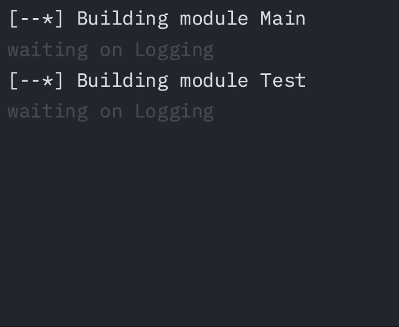

# TaskProgress

Show progress of multiple tasks in the terminal



> [!IMPORTANT]
> Library in early development, feedback is appreciated, expect bugs

## Example

```swift
ProgressIndicators.global.show()

let main = SpinnerProgressTask("Building module Main")
main.setMessage("waiting on Logging")
ProgressIndicators.global.addTask(main)

Task {
  try await Task.sleep(for: .seconds(1))
  let loggingTask = ProgressBarTask("Building module Logging", total: 100)
  ProgressIndicators.global.addTask(loggingTask)
  for _ in 0..<100 {
    loggingTask.progress()
    try await Task.sleep(for: .seconds(0.1))
  }
  main.finish()
}
```

You can run this example by cloning this repository and running `swift run`.

## TODO

- [ ] for ansi output: when terminal height is less than what is being outputted, then only print for available height, only at the end,
  print everything
